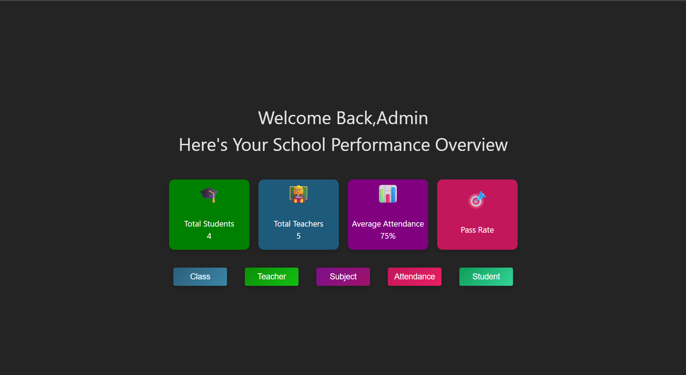

# 📊 Attendance Management System (React + MongoDB)

A full-stack Attendance Management System built using **React** for the frontend and **MongoDB** for data storage. This application helps manage students, teachers, and track attendance with a clean admin dashboard.

---

## 🚀 Features

* 👨‍🎓 Student Management (Add / View)
* 👩‍🏫 Teacher Management
* 🏫 Class & Subject Management
* 📅 Attendance Tracking System
* 📈 Dashboard Overview:

  * Total Students
  * Total Teachers
  * Average Attendance
  * Pass Rate

---

## 🖥️ Tech Stack

* **Frontend:** React.js, HTML, CSS, JavaScript
* **Backend:** Node.js / Express.js *(update if used)*
* **Database:** MongoDB
* **API:** REST API

---

## 📷 Screenshots



---

## ⚙️ How to Run Locally

### 1. Clone the repository

```bash
git clone https://github.com/siddeshparte106-cmd/attendance-app.git
```

### 2. Go to project folder

```bash
cd attendance-app
```

### 3. Install frontend dependencies

```bash
npm install
```

### 4. Start frontend

```bash
npm start
```

---

### 🔌 Backend Setup (if separate folder)

```bash
cd backend
npm install
npm start
```

---

### 🗄️ MongoDB Setup

* Create a MongoDB database (local or Atlas)
* Add your connection string in `.env` file:

```env
MONGO_URI=mongodb://127.0.0.1:27017/attendanceDB
```

---

## 🧠 Future Improvements

* 🔐 Authentication (Login/Register)
* 📊 Data visualization (charts)
* 📱 Mobile responsiveness
* ☁️ Deployment (Vercel + Render)

---

## 👤 Author

**Siddesh Parte**
GitHub: https://github.com/siddeshparte106-cmd

---

## 📌 Note

This project is built for learning and demonstration purposes using MERN stack concepts.
